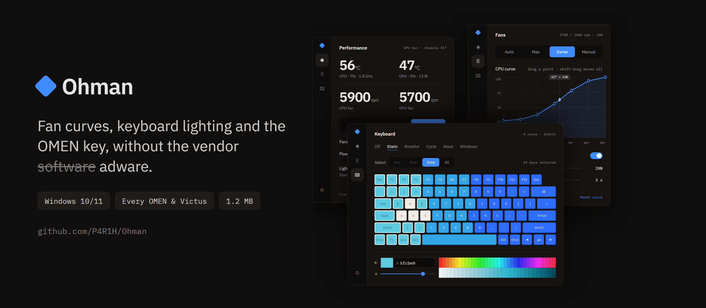

<p align="center"></p>

<p align="center">
<a href="https://github.com/P4R1H/Ohman/releases/latest/download/Ohman.exe"></a>
&nbsp;
<a href="https://ohmanapp.github.io/"></a>
<a href="docs/laptops.md"></a>
<a href="docs/research.md"></a>
</p>

Don't you love paying $2,500 for a laptop and still having ads pushed down your throat by mandatory software
with no alternative? Ohman is the alternative. One executable, no services, no drivers, no account, no ads.
Same firmware interface as OMEN Gaming Hub, same bytes, nothing else.

## Features

| | |
|---|---|
| **Modes** | Eco · Balanced · Performance, one click, the OMEN key, or a hotkey. Each mode remembers its own fans, power gain and GPU choice, and the whole window takes that mode's colour. |
| **Fans** | Auto (this model's own curve), Max, Manual per fan, or your own curve: seven points you drag, a floor, a ramp delay, and a separate GPU curve if you unlink it. The live reading rides the curve. |
| **Max fan** | Full speed with a way back: it returns to Auto once the chips are below 60° for two minutes, or after 15, 30 or 60 minutes. |
| **Power gain** | OGH's "Smart Performance Gain": +0 to +15 W on the CPU+GPU budget NVIDIA Dynamic Boost draws from. |
| **GPU power** | Base · Boost · Max, or follow the mode. |
| **Graphics** | Hybrid, Discrete (the MUX) or iGPU only, whichever the firmware offers, with the restart it needs. |
| **Lighting** | The keyboard drawn as it actually lights. Select a key, a row, a zone or the whole board, then pick a hue and a shade; or Breathe, Cycle, Wave, or hand it to Windows Dynamic Lighting. One zone, four zones or per key, whichever your keyboard has. |
| **Display** | Refresh rate, and the lowest rate on battery if you want it. |
| **Live** | CPU and GPU temperature, CPU package watts, fan speeds, load, clocks, chassis sensor, battery. CPU temperature on the tray icon. |
| **Tray** | Modes, fan mode, the backlight, refresh rate and graphics, without opening the window. |
| **OMEN key** | Opens the panel, cycles modes, toggles max fan, or runs a command of your choice. OGH's key handler is stopped, reversibly. Shift+F11 cycles modes; Ctrl+Alt+E/B/P/M/O for the rest. |
| **Safety** | A thermal guard forces max fan on a hot CPU, a hot chassis or stalled fans. It can be switched off, with a warning. Levels between 1 and 1800 rpm are refused, because no fan holds them; 0 is allowed, and stops them. |
| **Updates** | A newer build is fetched in the background and waits. Restart into it when it suits you, from Settings or the rail. Nothing is installed behind your back. |
| **Extras** | Starts with Windows without a UAC prompt, Eco on battery, Windows power-mode sync, and an on-screen flash when a key changes something. |

Settings live in `ohman.state`, everything the app does goes to `ohman.log`. Both sit beside the executable.

To remove it: **Uninstall** in Settings. That undoes everything Ohman changed on the laptop, hands the fans
and the keyboard back, re-enables OMEN Gaming Hub's tasks, deletes its own settings and log, and quits. Delete
the folder afterwards and nothing of it is left.

## Install

Download `Ohman.exe` from [Releases](../../releases/latest) and run it. It asks for administrator rights,
because the firmware interface needs them. It starts with Windows from then on, which you can turn off in
Settings.

Or build it with the compiler that already ships inside Windows. No SDK, no NuGet, no toolchain:

```
build.cmd
```

`preview\Ohman.exe` is the same UI on simulated hardware and needs no administrator rights.

## Your laptop

**Every OMEN and Victus laptop is supported.** Ohman asks the firmware what generation it is and drives it
accordingly. Controls your firmware does not offer are hidden rather than broken.

OMEN 15, 16 and 17 &middot; OMEN MAX 16 &middot; OMEN Transcend 14 and 16 &middot; Victus 15 and 16, including
the S and R.

Note: Ohman was built and checked byte for byte against OMEN Gaming Hub on one machine, an HP OMEN
Transcend 14 (2024, board 8C58). Owners have since run the checklist on their own boards and confirmed
them; every model and its board ids are in [docs/laptops.md](docs/laptops.md).

> ### Get yours verified
> Five minutes: run [the checklist](docs/laptops.md#verifying-your-laptop) and `tools\support-info.cmd`, then
> open a **Verify my laptop** issue with the file it writes. Everybody with that board then gets a profile
> that has been tested on a real machine instead of worked out from the firmware.

If a control is wrong on your model, open a **New laptop support** issue with the same file and, if you can get
it, OGH's own log from a session where you clicked every mode:
`%LOCALAPPDATA%\Packages\AD2F1837.OMENCommandCenter_v10z8vjag6ke6\LocalCache\Local\HPOMEN\`. That log is what
made the Transcend 14 profile exact.

## How it works

HP exposes a BIOS mailbox as the WMI class `hpqBIntM`. Ohman uses the commands OGH uses: performance mode
(`0x1A`), max fan (`0x27`), fan levels (`0x2E`), CPU+GPU power budget (`0x29`), GPU power (`0x22`), graphics
mode (`0x52`), keyboard lighting (`0x20009`), plus read-only queries. The OMEN key arrives as a WMI event
(`hpqBEvnt`). Every byte and every measured firmware behaviour is written down in
[docs/research.md](docs/research.md), including the things that are *not* safe to do and why.

- The firmware forgets a user-defined fan state after about 120 seconds, so Ohman keeps renewing it. That is
  why it has to stay running to hold a curve. It never writes a level between 1 and 1800 rpm, because no fan
  holds one; 0 it will write, because that is off and HP's own tables ask for it.
- The thermal guard runs on its own ten-second timer and forces maximum fan whatever mode you picked.

## Adding a laptop in code

A verified laptop is one entry in [`src/Platform.cs`](src/Platform.cs):

```csharp
new PlatformProfile {
    Name = "HP OMEN 16 (2023, 16-wf0xxx)",
    Boards = new[] { "8BAA" },
    Notes  = "Verified 2026-09-10 against OGH 1101.x logs."
}
```

Everything else either has a default or is read from the firmware at run time. Override only what the evidence
says is different, and put the evidence in `Notes`. A support issue becomes exactly that entry and a pull
request; see [CONTRIBUTING.md](CONTRIBUTING.md).

## Tools

| | |
|---|---|
| `tools\support-info.cmd` | data for a support request |
| `tools\verify.cmd` | read-only check of every query the app uses, plus a key-event capture |
| `tools\lighttest.cmd` | read-only: every lighting device on the machine and which ones are switched on |
| `tools\powertest.ps1` | A/B the power-gain slider on GPU watts and clocks |
| `tools\fantest.cmd` | holds the fans at zero for 60 s, then aborts on its own. Run it on a cool, idle machine |
| `tools\fanwatch.cmd` | writes a fan level every 5 s for 15 minutes and records what the firmware answered. For fans that stop responding during a game |
| `tools\modetest.cmd` | sends every known mode byte and watches the fans, for laptops where the modes do nothing |
| `tools\omenprobe.exe` | CLI for raw BIOS calls |

## Layout

```
src\Platform.cs   platform profiles: the only model-specific file
src\Hardware.cs   the WMI/BIOS mailbox + simulated hardware
src\Lighting.cs   keyboard lighting (0x20009) + the Windows Dynamic Lighting hand-over
src\Engine.cs     settings, apply logic, keep-alive, thermal guard, OMEN key, OGH takeover
src\Sensors.cs    perf counters + nvidia-smi
src\Curve.cs      the fan-curve graph
src\Keyboard.cs   the keyboard drawing
src\Ui.xaml, .cs  window, pages, tray, hotkeys, on-screen flash
src\Program.cs    entry point
fonts\            IBM Plex, embedded in the exe (OFL, see fonts\OFL.txt)
```

Pushing a `v*` tag builds on a Windows runner and attaches the binaries to a release.

## Later

- **Configurable hotkeys**, instead of the fixed set.
- **A thermal guard you can set**: the speed it goes to, next to the switch that turns it on, so it can be a
  rescue rather than always full fans.
- **Benchmarking tab**: run a short load and record clocks, watts, temperatures and throttling.
- **Fan curve import/export** so a verified model's curve can be shared as a file.

Ideas and issues are welcome.

## Risk

While this has been tested extensively, it is still sending commands to your laptop's firmware.
Use at your own risk.

## Declaration

Fable 5.1 was used for in-depth research on laptop models and their manuals so I can add extensive device support
to Ohman. It also assisted in code-writing. The code has been independently verified and security reviewed. Feel free to review it on your own terms and suggest improvements if any.

## Licence

GPL-3.0-or-later for the code. OFL 1.1 for the Font.

OMEN is a trademark of HP Inc. This project is not affiliated with HP.
